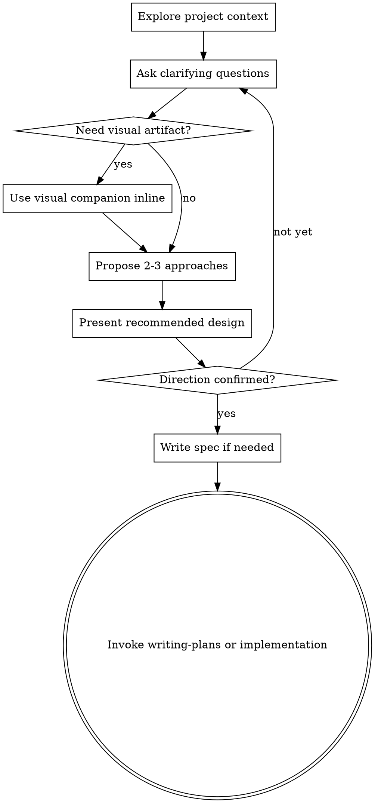

# Brainstorm Ambiguous Ideas Into Designs

Help turn partially formed requests into a clear direction, scoped design, or durable spec.

This skill is for reducing ambiguity. It is not a mandatory preflight for every implementation task.

## Trigger Guardrails

- Use this skill when the user is exploring options, asking for ideation, comparing directions, or lacks a concrete spec.
- Skip this skill when the request already names specific files, behaviors, acceptance criteria, or a clearly bounded change.
- Skip this skill for routine fixes, narrow refactors, dependency bumps, config changes, or other work where discovery would add friction.

## Working Rule

Do not block concrete work behind unnecessary brainstorming. When this skill is active, stay in discovery and design until the direction is clear enough to hand off to planning or implementation.

## Checklist

Complete these items in order:

1. **Explore project context** — check the relevant files, docs, and recent changes
2. **Ask clarifying questions** — one at a time, only for the missing information that matters
3. **Propose 2-3 approaches** — explain trade-offs and recommend one
4. **Present the design** — scale the detail to the problem, then confirm the direction
5. **Write a spec if needed** — do this when the result needs durable handoff, multi-step execution, or cross-session continuity
6. **Transition onward** — invoke `writing-plans` if a separate implementation plan is needed; otherwise return to the active implementation flow

## Process Flow

## The Process

**Understanding the idea:**

- Check the current project state first and follow existing patterns
- Assess scope early; if the request really contains multiple independent systems, decompose it before refining details
- Ask one question per message when questions are needed
- Prefer multiple choice when it reduces effort, but do not force it
- Focus on purpose, constraints, success criteria, and out-of-scope edges
- Stop asking once the direction is actionable; do not keep the loop alive for its own sake

**Exploring approaches:**

- Propose 2-3 viable approaches with clear trade-offs
- Lead with the recommended option and explain why it best fits the stated goals
- Keep alternatives meaningfully different; avoid cosmetic variations presented as separate options

**Presenting the design:**

- Present a design once the ambiguity has narrowed enough to make a recommendation
- Scale the output to the problem: a few sentences for small choices, fuller sections for larger systems
- Cover the parts that matter for the request: architecture, boundaries, data flow, failure handling, rollout, testing, or UX
- Confirm the direction before handing off to implementation or writing a durable spec

**Design for isolation and clarity:**

- Break work into smaller units with one clear purpose
- Prefer well-defined interfaces and boundaries that are easy to understand and test
- Include targeted cleanups when current structure would otherwise make the change confusing or fragile
- Avoid unrelated refactoring

**Working in existing codebases:**

- Explore the current structure before proposing changes
- Follow established patterns unless the request explicitly calls for a new direction
- If existing code shape will block the goal, include the smallest design adjustment that makes the work clearer and safer

## After the Design

**Documentation:**

- Write a spec only when it adds durable value: handoff, multi-session continuity, coordination across people or agents, or large multi-step work
- Default path: `docs/superpowers/specs/YYYY-MM-DD-<topic>-design.md`
- User preferences for spec location override the default
- Use `elements-of-style:writing-clearly-and-concisely` if available
- Commit the spec when committing project artifacts is appropriate for the active workflow

**Spec Self-Review:**

If you write a spec, review it once before handing off:

1. **Placeholder scan:** remove `TBD`, `TODO`, and vague requirements
2. **Internal consistency:** align architecture, scope, and feature descriptions
3. **Scope check:** keep the work small enough for the next execution step
4. **Ambiguity check:** choose and state the intended interpretation where wording could split

Fix issues inline and move on.

**Handoff:**

- If the outcome needs a separate implementation plan, invoke `writing-plans`
- If the direction is already concrete enough, return control to the active implementation flow without forcing an extra planning phase

## Key Principles

- **Brainstorm only when needed** — ambiguity reduction, not ritual
- **One question at a time** — avoid dumping a questionnaire on the user
- **Multiple choice when helpful** — reduce effort, do not constrain thought
- **YAGNI ruthlessly** — remove unnecessary features from the proposed design
- **Explore real alternatives** — compare materially different approaches
- **Validate incrementally** — confirm the direction before implementation
- **Stay lightweight** — stop once the path is clear

## Visual Companion

A browser-based companion for showing mockups, diagrams, and visual options during brainstorming.

- Use it only when a visual artifact will clarify the question better than plain text
- Do not send a separate opt-in or consent message before using it
- If you switch to the browser, explain inline what you are showing and continue the conversation
- Keep text-first questions in the terminal, even if the topic is UI-related

A question about a UI topic is not automatically a visual question. "What does personality mean in this context?" is conceptual and belongs in the terminal. "Which wizard layout works better?" is visual and can use the browser.

If you choose to use the companion, read the detailed guide before proceeding:
`skills/brainstorming/visual-companion.md`
